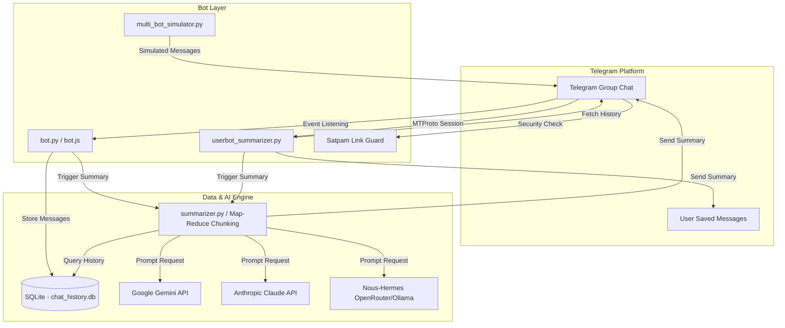

# 🤖 Telegram AI Agent Suite & Chat Summarizer

[](https://www.python.org/)
[](https://nodejs.org/)
[](https://aistudio.google.com/)
[](LICENSE)

Solusi **AI Agent otonom berbasis Telegram** yang secara cerdas membaca, menyimpan, menganalisis riwayat obrolan grup, serta menghasilkan ringkasan komprehensif berbobot tinggi (*Topik Utama, Keputusan, Action Items + PIC, dan Link penting*). 

Proyek ini juga dilengkapi dengan **Satpam Anti-Spam Link Guard**, **UserBot Private Summarizer (MTProto)** untuk grup rahasia, **Multi-Bot Live Simulator**, dan opsi deployment cloud 24/7.

---

## 📌 Daftar Isi
- [🎯 Solusi & Manfaat Utama](#-solusi--manfaat-utama)
- [📋 Fitur & Modul Utama](#-fitur--modul-utama)
- [🏗 Arsitektur & Teknologi](#-arsitektur--teknologi)
- [📁 Struktur Project](#-struktur-project)
- [💻 Prasyarat Sistem](#-prasyarat-sistem)
- [⚙️ Panduan Instalasi & Konfigurasi](#%EF%B8%8F-panduan-instalasi--konfigurasi)
  - [1. Clone Repository & Setup Virtualenv](#1-clone-repository--setup-virtualenv)
  - [2. Dapatkan API Key & Bot Token](#2-dapatkan-api-key--bot-token)
  - [3. Konfigurasi File `.env`](#3-konfigurasi-file-env)
- [🚀 Cara Penggunaan & Pengoperasian](#-cara-penggunaan--pengoperasian)
  - [A. Menjalankan Bot Telegram Utam (Python)](#a-menjalankan-bot-telegram-utama-python)
  - [B. Menjalankan Versi Node.js](#b-menjalankan-versi-nodejs)
  - [C. Menjalankan Private UserBot (Tanpa Bot di Grup)](#c-menjalankan-private-userbot-tanpa-bot-di-grup)
  - [D. Menjalankan Multi-Bot Live Simulator](#d-menjalankan-multi-bot-live-simulator)
- [📱 Daftar Perintah Telegram (Commands)](#-daftar-perintah-telegram-commands)
- [🧪 Pengujian (Testing & Verification)](#-pengujian-testing--verification)
- [☁️ Panduan Deployment (24/7 Cloud & VPS)](#%EF%B8%8F-panduan-deployment-247-cloud--vps)
- [📄 Lisensi & Kontribusi](#-lisensi--kontribusi)

---

## 🎯 Solusi & Manfaat Utama

- ⏱️ **Mengatasi Chat Menumpuk**: Tidak perlu menghabiskan 15–30 menit sehari hanya untuk *scrolling* ratusan atau ribuan pesan grup.
- 🎯 **Tindak Lanjut & Keputusan Jelas**: Setiap keputusan penting dan *action item* langsung diidentifikasi lengkap dengan **Person In Charge (PIC)** yang bertanggung jawab.
- ⚡ **Ringkas Dalam < 2 Menit**: Membaca ringkasan eksekutif berstruktur lengkap selesai dalam hitungan detik.
- 🛡️ **Grup Bebas Spam**: Fitur Satpam memproteksi grup dari penyebaran link phishing/anomali oleh anggota biasa.
- 🤫 **Monitoring Rahasia**: Fitur UserBot memungkinkan analisis ringkasan grup tanpa mengundang bot publik ke dalam grup.

---

## 📋 Fitur & Modul Utama

1. **Penyimpanan Histori Asynchronous (`database.py` / `database.js`)**:
   - Menggunakan SQLite dengan driver async (`aiosqlite`) untuk kinerja tinggi tanpa mengganggu event loop.
   - Otomatis membersihkan pesan lama yang melebihi batas waktu (cleanup 30 hari).

2. **Ringkasan Cerdas On-Demand (`/summary`)**:
   - `/summary` — Meringkas obrolan dari jam ringkasan terakhir (default: 24 jam).
   - `/summary 6h` / `/summary 2d` — Meringkas obrolan dengan fleksibilitas rentang waktu dinamis.
   - Fitur **Map-Reduce / Chunking**: Menangani obrolan hingga ribuan pesan tanpa terkendala batasan token AI.

3. **Satpam Anti-Spam Link Guard (`/satpam`)**:
   - **Mode Admin Only**: Hanya admin grup yang diizinkan mengirimkan link/URL.
   - **Mode Domain Whitelist**: Mengizinkan link dari domain tepercaya (misal: `github.com`, `google.com`, `zoom.us`).
   - Peringatan otomatis dengan fitur *self-destruct* (otomatis terhapus) agar grup tetap bersih.

4. **Scheduled Auto-Summarizer (`/schedule`)**:
   - `/schedule <jam>` — Bot mengirimkan ringkasan otomatis berkala ke grup (misal setiap 4 jam).
   - `/unschedule` — Mematikan penjadwalan otomatis.

5. **Multi-AI Provider Engine (`summarizer.py`)**:
   - **Google Gemini** (`gemini-3.6-flash`) — *Default & 100% Gratis*.
   - **Anthropic Claude** (`claude-3-5-sonnet-20241022`).
   - **Nous-Hermes / OpenRouter / Ollama** (`hermes-3-llama-3.1-8b`).

6. **Private UserBot Summarizer (`userbot_summarizer.py`)**:
   - Berjalan dengan protokol MTProto Telethon.
   - Membaca obrolan grup rahasia secara *silent* dan mengirimkan ringkasan langsung ke **Saved Messages** Telegram pengguna.

7. **Multi-Bot Live Simulator (`multi_bot_simulator.py`)**:
   - Mengisi obrolan grup secara *live* dengan karakter tim virtual (PM, Backend Lead, QA Lead, Designer, DevOps) untuk menguji fitur bot secara instan.

---

## 🏗 Arsitektur & Teknologi



---

## 📁 Struktur Project

```text
c:\aiagent\
├── bot.py                      # Main entry point Telegram Bot (Python/python-telegram-bot)
├── bot.js                      # Main entry point Telegram Bot alternatif (Node.js)
├── database.py                 # SQLite database engine (Async / aiosqlite)
├── database.js                 # SQLite database engine alternatif (Node.js sqlite3)
├── summarizer.py               # Prompt engine, Map-Reduce chunking & AI Multi-Provider API
├── summarizer.js               # Summarizer engine alternatif (Node.js)
├── config.py                   # Parsing & validasi konfigurasi environment
├── config.js                   # Parsing konfigurasi (Node.js)
├── userbot_summarizer.py       # Private UserBot client (Telethon MTProto)
├── multi_bot_simulator.py      # Simulator obrolan multi-bot otonom
├── autonomous_group_bots.py    # Multi-persona AI agent listener & responder
├── generate_string_session.py  # Utility pembuat Telegram StringSession
├── DEPLOY_GUIDE.md             # Panduan deployment cloud (Railway & Docker VPS)
├── Dockerfile                  # Konfigurasi container Docker
├── railway.toml                # File konfigurasi deploy Railway
├── requirements.txt            # Daftar dependensi Python
├── package.json                # Konfigurasi project & dependensi Node.js
├── .env.example                # Template konfigurasi environment variable
├── run_bot.bat                 # Shortcut script peluncuran Bot Utama
├── run_userbot.bat             # Shortcut script peluncuran UserBot
├── run_simulator.bat           # Shortcut script peluncuran Simulator
├── install_auto_start.bat      # Script konfigurasi Startup Windows
└── tests/                      # Suite unit testing (Satpam, Database, UserBot)
    ├── test_satpam.py          # Unit test untuk fitur Satpam Anti-Spam Link
    └── test_private_userbot_ready.py # Unit test kesiapan modul UserBot
```

---

## 💻 Prasyarat Sistem

- **Sistem Operasi**: Windows 10/11, Linux (Ubuntu/Debian), atau macOS.
- **Python**: Versi `3.11` atau yang lebih baru.
- **Node.js** *(Opsional)*: Versi `20.x` atau lebih baru jika ingin menggunakan runner Node.js.
- **Akun Telegram**: Akun aktif & Bot Token dari [@BotFather](https://t.me/BotFather).
- **API Key AI**:
  - Google Gemini API Key *(Gratis - Direkomendasikan)* dari [Google AI Studio](https://aistudio.google.com/).
  - *Atau* Anthropic Claude API Key dari [Anthropic Console](https://console.anthropic.com/).
  - *Atau* OpenRouter / Ollama Key untuk model Hermes.

---

## ⚙️ Panduan Instalasi & Konfigurasi

### 1. Clone Repository & Setup Virtualenv

Buka terminal / PowerShell dan jalankan perintah berikut:

```bash
# Clone atau masuk ke direktori proyek
cd c:\aiagent

# Buat virtual environment Python
python -m venv venv

# Aktifkan virtual environment
# Pada Windows PowerShell:
.\venv\Scripts\Activate.ps1
# Pada Command Prompt Windows:
.\venv\Scripts\activate.bat
# Pada Linux / macOS:
source venv/bin/activate

# Install seluruh dependensi Python
pip install -r requirements.txt
```

*(Opsional untuk Node.js)*:
```bash
npm install
```

---

### 2. Dapatkan API Key & Bot Token

#### A. Bot Token Telegram
1. Buka Telegram dan chat ke **[@BotFather](https://t.me/BotFather)**.
2. Kirim perintah `/newbot` dan ikuti petunjuk hingga mendapatkan **Bot Token**.
3. **PENTING (Group Privacy Mode)**:
   - Agar bot dapat membaca seluruh obrolan grup, jalankan:
     `/setprivacy` ➡️ Pilih Bot Anda ➡️ **Disable**.
   - Pastikan BotFather merespons: `Success! The new status is: DISABLED.`

#### B. API Key AI (Google Gemini - Gratis)
1. Buka [Google AI Studio](https://aistudio.google.com/app/apikey).
2. Login dengan akun Google Anda.
3. Klik **Create API Key** dan simpan kunci API tersebut.

---

### 3. Konfigurasi File `.env`

Salin file `.env.example` menjadi `.env`:

```bash
copy .env.example .env
```

Buka file `.env` dengan text editor dan atur nilai variabel yang dibutuhkan:

```env
# Token utama dari @BotFather
TELEGRAM_BOT_TOKEN=7123456789:ABCDefgh-1234567890

# Konfigurasi Provider AI ("gemini", "anthropic", atau "hermes")
AI_PROVIDER=gemini

# Google Gemini API Key (Gratis di https://aistudio.google.com/)
GEMINI_API_KEY=AIzaSy...
GEMINI_MODEL=gemini-3.6-flash

# (Opsional) Anthropic Claude API Key
ANTHROPIC_API_KEY=sk-ant-api03-...
ANTHROPIC_MODEL=claude-3-5-sonnet-20241022

# (Opsional) Nous-Hermes AI via OpenRouter / Ollama
HERMES_API_KEY=sk-or-v1-...
HERMES_MODEL=nousresearch/hermes-3-llama-3.1-8b:free
HERMES_BASE_URL=https://openrouter.ai/api/v1

# Credentials UserBot Rahasia (Dapatkan dari https://my.telegram.org)
TELEGRAM_API_ID=12345678
TELEGRAM_API_HASH=abcdef1234567890abcdef1234567890
TELEGRAM_STRING_SESSION=

# Pengaturan Umum Bot
DEFAULT_SUMMARY_HOURS=24
DATABASE_PATH=chat_history.db
MAX_MESSAGES_PER_CHUNK=80
```

---

## 🚀 Cara Penggunaan & Pengoperasian

### A. Menjalankan Bot Telegram Utama (Python)

```bash
python bot.py
# Atau gunakan shortcut Windows:
.\run_bot.bat
```

**Output Log Sukses**:
```text
INFO - Database initialized successfully at chat_history.db
INFO - Restoring 0 active schedules...
INFO - Starting Chat Summarizer Bot with model: gemini-3.6-flash
```

---

### B. Menjalankan Versi Node.js

Jika ingin menggunakan runtime Node.js:

```bash
npm start
# Atau pengujian sintaks:
npm run check
```

---

### C. Menjalankan Private UserBot (Tanpa Bot di Grup)

Fitur ini membaca grup obrolan secara rahasia tanpa mengundang bot ke grup.

1. **Membuat StringSession Login**:
   ```bash
   python generate_string_session.py
   ```
   Ikuti petunjuk memasukkan nomor HP dan kode OTP Telegram. Salin hasilnya ke `TELEGRAM_STRING_SESSION` di `.env`.

2. **Melihat Daftar Grup & Meringkas**:
   ```bash
   # Tampilkan daftar grup yang Anda ikuti
   python userbot_summarizer.py --list-groups

   # Ringkas grup spesifik (Ringkasan dikirim ke Pesan Tersimpan / Saved Messages)
   python userbot_summarizer.py --group "Nama Atau ID Grup" --hours 12
   ```

---

### D. Menjalankan Multi-Bot Live Simulator

Simulator ini berguna untuk pengujian otomatis tanpa harus mengetik manual di Telegram.

```bash
# Run simulator skenario Sprint Planning
python multi_bot_simulator.py --chat-id -100123456789 --scenario sprint

# Run simulator skenario Incident Response
python multi_bot_simulator.py --chat-id -100123456789 --scenario incident

# Run simulator dengan topik kustom
python multi_bot_simulator.py --chat-id -100123456789 --topic "Persiapan peluncuran fitur baru" --turns 8
```

---

## 📱 Daftar Perintah Telegram (Commands)

| Perintah | Akses | Deskripsi & Contoh Penggunaan |
| :--- | :--- | :--- |
| `/summary` | Semua Anggota | Meringkas obrolan sejak ringkasan terakhir (atau 24 jam terakhir secara default). |
| `/summary 6h` | Semua Anggota | Meringkas obrolan 6 jam terakhir. |
| `/summary 2d` | Semua Anggota | Meringkas obrolan 2 hari terakhir. |
| `/schedule <jam>` | Admin Grup | Mengaktifkan pembuatan ringkasan otomatis setiap `<jam>` jam (contoh: `/schedule 4`). |
| `/unschedule` | Admin Grup | Mematikan jadwal ringkasan otomatis di grup tersebut. |
| `/satpam` | Admin Grup | Mengatur proteksi Satpam Anti-Spam (misal `/satpam on`, `/satpam off`, `/satpam status`). |
| `/model` | Admin Grup | Melihat atau mengganti model AI yang digunakan secara aktif. |
| `/groups` | Admin Grup | Menampilkan daftar grup yang sedang dipantau oleh bot. |
| `/help` | Semua Anggota | Menampilkan pesan panduan bantuan penggunaan bot. |

---

## 📄 Contoh Format Output Ringkasan AI

```markdown
📊 RINGKASAN CHAT GRUP
🕒 Periode: 12 jam terakhir
💬 Total Pesan: 64 pesan

📌 TOPIK UTAMA
- Evaluasi bug autentikasi login di platform mobile v2.1.
- Pembagian tugas rilis patch hotfix ke staging & production.

✅ KEPUTUSAN & KESEPAKATAN
- Hotfix v2.1.1 akan dideploy sore ini pukul 17:00 WIB setelah melewati regression test.
- QA testing difokuskan pada auth flow Google OAuth.

📋 ACTION ITEMS & TINDAK LANJUT
- Merge PR #142 dan jalankan build staging — PIC: @budi_backend
- Testing OAuth flow di Android & iOS — PIC: @siti_qa
- Menyusun release notes publik — PIC: @andi_pm

🔗 LINK & REFERENSI PENTING
- PR Fix Token Expiry: https://github.com/org/repo/pull/142
- Google Meet Sync: https://meet.google.com/xyz-abcd-efg

— Dibuat otomatis oleh AI Agent Chat Summarizer Bot
```

---

## 🧪 Pengujian (Testing & Verification)

Proyek ini dilengkapi dengan suite pengujian otomatis untuk memastikan keandalan modul database, Satpam guard, dan kriteria UserBot.

Jalankan pengujian unit test dengan perintah:

```bash
# Pengujian modul Python
python -m unittest discover -s tests

# Pengujian sintaks & simulator Node.js
npm run check
```

---

## ☁️ Panduan Deployment (24/7 Cloud & VPS)

Untuk menjalankan bot secara **24 jam nonstop** agar tetap aktif meskipun komputer lokal dimatikan, ikuti panduan lengkap di [DEPLOY_GUIDE.md](file:///c:/aiagent/DEPLOY_GUIDE.md):

1. **Deploy ke Railway (PaaS - Recommended)**:
   - Push repository ini ke GitHub.
   - Sambungkan ke Railway, import repo (otomatis mendeteksi `Dockerfile`).
   - Masukkan Environment Variables di dashboard Railway.
2. **Deploy ke VPS (Docker)**:
   ```bash
   docker build -t telegram-aiagent .
   docker run -d --name aiagent --restart always telegram-aiagent
   ```

---

## 📄 Lisensi & Kontribusi

Proyek ini dilisensikan di bawah [MIT License](LICENSE). Kontribusi dan pull request sangat disambut baik untuk pengembangan fitur AI Agent lebih lanjut!
