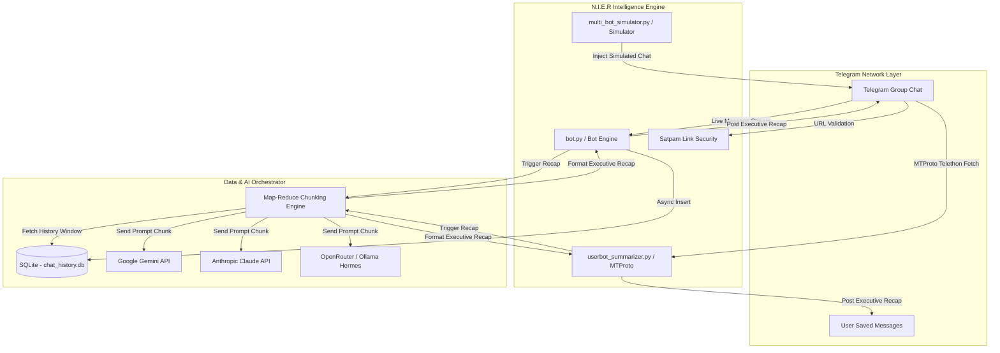

# ⚡ N.I.E.R AI — Network Intelligence & Executive Recap

[](https://www.python.org/)
[](https://nodejs.org/)
[](https://core.telegram.org/)
[](https://aistudio.google.com/)
[](https://www.docker.com/)
[](LICENSE)

> **N.I.E.R AI (Network Intelligence & Executive Recap)** adalah ekosistem AI Agent otonom berbasis Telegram yang dirancang khusus untuk memantau, mendeteksi, mendokumentasikan, dan memantau lalu lintas obrolan grup secara cerdas. 

> [!NOTE]
> **N.I.E.R AI** mengubah tumpukan ribuan pesan grup Telegram yang terfragmentasi menjadi **Executive Summaries berstruktur tinggi** (Topik Utama, Keputusan Bisnis/Teknis, Action Items + PIC, dan Link Penting) dalam waktu kurang dari 2 menit.

---

## 📌 Daftar Isi
- [💡 Apa itu N.I.E.R AI?](#-apa-itu-nier-ai)
- [✨ Fitur & Keunggulan Utama](#-fitur--keunggulan-utama)
- [🏗 Arsitektur Sistem & Alur Kerja](#-arsitektur-sistem--alur-kerja)
- [📁 Struktur Proyek](#-struktur-proyek)
- [💻 Prasyarat Sistem](#-prasyarat-sistem)
- [⚙️ Panduan Instalasi & Konfigurasi](#%EF%B8%8F-panduan-instalasi--konfigurasi)
  - [1. Clone Repository & Setup Environment](#1-clone-repository--setup-environment)
  - [2. Konfigurasi Bot Telegram & API Key](#2-konfigurasi-bot-telegram--api-key)
  - [3. Penyetelan File `.env`](#3-penyetelan-file-env)
- [🚀 Cara Penggunaan & Mode Operasi](#-cara-penggunaan--mode-operasi)
  - [Mode 1: N.I.E.R Telegram Bot Utama (Python)](#mode-1-nier-telegram-bot-utama-python)
  - [Mode 2: N.I.E.R Node.js Runner](#mode-2-nier-nodejs-runner)
  - [Mode 3: N.I.E.R Silent MTProto UserBot (Grup Rahasia)](#mode-3-nier-silent-mtproto-userbot-grup-rahasia)
  - [Mode 4: Multi-Bot Autonomous Simulator](#mode-4-multi-bot-autonomous-simulator)
- [📱 Daftar Perintah Bot (Telegram Commands)](#-daftar-perintah-bot-telegram-commands)
- [📊 Contoh Format Executive Recap](#-contoh-format-executive-recap)
- [🧪 Pengujian & Verifikasi System](#-pengujian--verifikasi-system)
- [☁️ Panduan Deployment (Docker & Cloud VPS)](#%EF%B8%8F-panduan-deployment-docker--cloud-vps)
- [📄 Lisensi & Kontribusi](#-lisensi--kontribusi)

---

## 💡 Apa itu N.I.E.R AI?

Dalam lingkungan kerja modern, grup komunikasi Telegram sering diisi oleh ratusan hingga ribuan pesan harian. Hal ini menyebabkan fenomena *information overload*, di mana keputusan penting, tenggat waktu (deadline), penunjukan penanggung jawab (PIC), dan tautan referensi berharga sering kali terkubur.

**N.I.E.R AI (Network Intelligence & Executive Recap)** hadir sebagai solusi *End-to-End Enterprise Intelligence*:

- 🧠 **Network Intelligence**: Mengawasi alur percakapan, mendeteksi potensi spam/link mencurigakan, dan mengklasifikasikan pesan secara waktu nyata (*real-time*).
- 📋 **Executive Recap**: Mengkompilasi riwayat diskusi panjang menjadi ringkasan eksekutif padat yang siap dibaca oleh manajer, C-level, maupun tim teknis.

---

## ✨ Fitur & Keunggulan Utama

### 1. 📊 Executive Recap Engine (Map-Reduce Chunking)
- **Dynamic Timeframe Query**: Mendukung `/summary`, `/summary 6h`, `/summary 2d`, hingga rentang waktu kustom.
- **Map-Reduce Architecture**: Obrolan super panjang dibagi menjadi *chunk-chunk* terkontrol (`MAX_MESSAGES_PER_CHUNK`), diproses secara paralel/sekuensial oleh LLM, lalu direkapitulasi menjadi laporan akhir yang utuh tanpa kehilangan konteks.
- **Identifikasi PIC & Task**: Otomatis mendeteksi siapa yang ditugaskan mengerjakan apa (`Action Item: @user — Task`).

### 2. 🛡️ Network Intelligence Guard (`/satpam`)
- **Anti-Spam Link Security**: Membatasi pengiriman link URL di grup obrolan.
- **Admin-Only & Domain Whitelisted Mode**: Mengatur agar hanya admin atau link dari domain tepercaya (misal: `github.com`, `google.com`, `zoom.us`) yang dapat lolos.
- **Auto Self-Destruct Warning**: Peringatan bot otomatis terhapus dalam beberapa detik untuk menjaga kerapian chat grup.

### 3. 🤖 Multi-Provider AI Matrix Engine
Dukungan pengoperasian fleksibel dengan berbagai provider kecerdasan buatan terkemuka:
- **Google Gemini** (`gemini-3.6-flash`) — *Default, Ultra Fast & Gratis*.
- **Anthropic Claude** (`claude-3-5-sonnet-20241022`) — *Analisis Logika & Bahasa Tingkat Tinggi*.
- **Nous-Hermes AI** (`hermes-3-llama-3.1-8b`) — *Integrasi OpenRouter & LLM Lokal via Ollama*.

### 4. 🕵️ Silent MTProto Private UserBot (`userbot_summarizer.py`)
- Memungkinkan analisis dan ekstraksi ringkasan grup **tanpa perlu mengundang bot publik** ke dalam grup.
- Berjalan via protokol MTProto Telegram (Telethon), membaca riwayat obrolan secara *silent*, dan langsung mengirimkan **Executive Recap** ke **Saved Messages** Telegram pengguna.

### 5. ⏰ Scheduled Auto-Recap (`/schedule`)
- Fitur penjadwalan otomatis untuk mengeksekusi dan mengrimkan laporan ringkasan rutin ke grup (misal: Setiap 4 jam, 8 jam, atau harian).

### 6. 🎭 Autonomous Multi-Persona Simulator
- Simulasi obrolan tim otonom (`multi_bot_simulator.py` & `autonomous_group_bots.py`) dengan persona spesifik (*Product Manager, Backend Lead, QA Lead, UI/UX Designer, DevOps*) untuk pengujian langsung tanpa perlu obrolan manual.

### 7. ⚡ Asynchronous Storage Engine
- Ditenagai oleh **SQLite Async (`aiosqlite`)** dengan indeks optimal untuk menyimpan riwayat chat secara instan tanpa membebani *main event loop*. Fitur pembersihan otomatis (*auto cleanup*) menyimpan data secara efisien.

---

## 🏗 Arsitektur Sistem & Alur Kerja

Berikut adalah alur arsitektur dari **N.I.E.R AI**:



---

## 📁 Struktur Proyek

```text
c:\aiagent\
├── bot.py                      # Core Telegram Bot Handler (Python / python-telegram-bot)
├── bot.js                      # Core Telegram Bot Handler alternatif (Node.js)
├── summarizer.py               # N.I.E.R Executive Recap Engine & Multi-AI Orchestrator
├── summarizer.js               # Executive Recap Engine alternatif (Node.js)
├── database.py                 # Async SQLite Engine (aiosqlite) & Chat Log Persistence
├── database.js                 # SQLite Database Driver alternatif (Node.js)
├── config.py                   # Environment Configuration & Validation Parser
├── config.js                   # Environment Parser alternatif (Node.js)
├── userbot_summarizer.py       # Silent MTProto Private Intelligence Client (Telethon)
├── multi_bot_simulator.py      # Autonomous Multi-Bot Conversation Simulator
├── autonomous_group_bots.py    # AI Multi-Persona Group Chat Responders
├── generate_string_session.py  # Interactive Telegram StringSession Generator
├── DEPLOY_GUIDE.md             # Guide Deployment Cloud (Railway, Docker VPS, Systemd)
├── Dockerfile                  # Industrial-grade Container Specification
├── railway.toml                # Railway Cloud Deployment Configuration
├── requirements.txt            # Python Dependencies Manifest
├── package.json                # Node.js Dependencies Manifest
├── .env.example                # Template Environment Variables
├── run_bot.bat                 # Windows Launcher - Main N.I.E.R Bot
├── run_userbot.bat             # Windows Launcher - Silent UserBot
├── run_simulator.bat           # Windows Launcher - Autonomous Simulator
├── install_auto_start.bat      # Windows Startup Integration Script
└── tests/                      # Automated Verification & Unit Test Suite
    ├── test_satpam.py          # Unit Test Satpam Link Guard Engine
    └── test_private_userbot_ready.py # Unit Test UserBot Readiness
```

---

## 💻 Prasyarat Sistem

- **Sistem Operasi**: Windows 10/11, Linux (Ubuntu/Debian), atau macOS.
- **Python**: Versi `3.11` atau lebih baru.
- **Node.js** *(Opsional)*: Versi `20.x` atau lebih baru (jika memilih runner Node.js).
- **Akun Telegram**: Akun aktif & Bot Token dari [@BotFather](https://t.me/BotFather).
- **AI Provider API Key**:
  - **Google Gemini API Key** *(Rekomendasi - Fast & Free)*: [Google AI Studio](https://aistudio.google.com/)
  - **Anthropic Claude API Key** *(Opsional)*: [Anthropic Console](https://console.anthropic.com/)
  - **OpenRouter / Ollama Key** *(Opsional)*: Untuk model Hermes 3.

---

## ⚙️ Panduan Instalasi & Konfigurasi

### 1. Clone Repository & Setup Environment

Buka terminal atau PowerShell, lalu jalankan perintah berikut:

```bash
# Masuk ke direktori proyek
cd c:\aiagent

# Buat virtual environment Python
python -m venv venv

# Aktifkan virtual environment
# Pada Windows PowerShell:
.\venv\Scripts\Activate.ps1
# Pada Command Prompt:
.\venv\Scripts\activate.bat
# Pada Linux / macOS:
source venv/bin/activate

# Install seluruh dependensi proyek
pip install -r requirements.txt
```

*(Opsional untuk Node.js Runner)*:
```bash
npm install
```

---

### 2. Konfigurasi Bot Telegram & API Key

1. **Bot Token Telegram**:
   - Buka Telegram dan kirim pesan ke **[@BotFather](https://t.me/BotFather)**.
   - Ketik `/newbot` dan ikuti instruksi hingga Anda mendapatkan **Bot Token**.
   - **PENTING (Group Privacy Mode)**:
     Ketik `/setprivacy` ➡️ Pilih Bot Anda ➡️ **Disable**. *(Langkah ini wajib dilakukan agar bot dapat membaca seluruh obrolan grup)*.

2. **Google Gemini API Key**:
   - Akses [Google AI Studio](https://aistudio.google.com/app/apikey).
   - Klik **Create API Key** dan salin kunci API tersebut.

---

### 3. Penyetelan File `.env`

Salin file `.env.example` menjadi `.env`:

```bash
copy .env.example .env
```

Buka file `.env` dengan text editor dan sesuaikan nilainya:

```env
# Token Utama Bot dari @BotFather
TELEGRAM_BOT_TOKEN=7123456789:ABCDefgh-1234567890

# Pilihan Provider AI ("gemini", "anthropic", atau "hermes")
AI_PROVIDER=gemini

# Provider 1: Google Gemini (GRATIS)
GEMINI_API_KEY=AIzaSy...
GEMINI_MODEL=gemini-3.6-flash

# Provider 2: Anthropic Claude (Opsional)
ANTHROPIC_API_KEY=sk-ant-api03-...
ANTHROPIC_MODEL=claude-3-5-sonnet-20241022

# Provider 3: Nous-Hermes via OpenRouter / Ollama (Opsional)
HERMES_API_KEY=sk-or-v1-...
HERMES_MODEL=nousresearch/hermes-3-llama-3.1-8b:free
HERMES_BASE_URL=https://openrouter.ai/api/v1

# Credentials Client API Telegram (Untuk Silent UserBot MTProto)
TELEGRAM_API_ID=12345678
TELEGRAM_API_HASH=abcdef1234567890abcdef1234567890
TELEGRAM_STRING_SESSION=

# Pengaturan Default N.I.E.R Engine
DEFAULT_SUMMARY_HOURS=24
DATABASE_PATH=chat_history.db
MAX_MESSAGES_PER_CHUNK=80
```

---

## 🚀 Cara Penggunaan & Mode Operasi

### Mode 1: N.I.E.R Telegram Bot Utama (Python)

Jalankan bot utama dalam mode monitor live:

```bash
python bot.py
# Atau gunakan launcher Windows:
.\run_bot.bat
```

> [!TIP]
> Saat bot berjalan, tambahkan bot ke dalam grup Telegram Anda dan berikan hak akses Admin (khususnya untuk menghapus pesan jika menggunakan Satpam Guard).

---

### Mode 2: N.I.E.R Node.js Runner

Jika Anda lebih menyukai runtime Node.js:

```bash
npm start
```

---

### Mode 3: N.I.E.R Silent MTProto UserBot (Grup Rahasia)

Mode ini bekerja memantau grup obrolan rahasia dari akun personal Anda tanpa perlu memasukkan Bot Telegram ke grup tersebut.

1. **Membuat StringSession Login**:
   ```bash
   python generate_string_session.py
   ```
   Masukkan nomor ponsel dan kode OTP Telegram. Hasil `TELEGRAM_STRING_SESSION` akan otomatis dihasilkan. Salin kode tersebut ke file `.env`.

2. **Menampilkan Daftar Grup & Ekstraksi Ringkasan**:
   ```bash
   # Tampilkan daftar grup yang Anda ikuti beserta Chat ID-nya
   python userbot_summarizer.py --list-groups

   # Meringkas obrolan grup spesifik (Ringkasan dikirim langsung ke Saved Messages Anda)
   python userbot_summarizer.py --group "Nama Grup Atau ID" --hours 12
   ```

---

### Mode 4: Multi-Bot Autonomous Simulator

Gunakan simulator ini untuk menguji performa ringkasan N.I.E.R AI dengan simulasi tim obrolan otonom:

```bash
# Skenario Sprint Planning (PM, Backend, QA, UI/UX, DevOps)
python multi_bot_simulator.py --chat-id -100123456789 --scenario sprint

# Skenario Incident Response
python multi_bot_simulator.py --chat-id -100123456789 --scenario incident

# Skenario Topik Kustom
python multi_bot_simulator.py --chat-id -100123456789 --topic "Persiapan Peluncuran Fitur Pembayaran" --turns 10
```

---

## 📱 Daftar Perintah Bot (Telegram Commands)

| Perintah | Hak Akses | Deskripsi & Contoh Penggunaan |
| :--- | :--- | :--- |
| `/summary` | Semua Anggota | Meringkas obrolan sejak ringkasan terakhir (default: 24 jam). |
| `/summary 6h` | Semua Anggota | Meringkas obrolan 6 jam terakhir. |
| `/summary 2d` | Semua Anggota | Meringkas obrolan 2 hari terakhir. |
| `/schedule <jam>` | Admin Grup | Mengaktifkan penjadwalan ringkasan otomatis setiap `<jam>` jam (contoh: `/schedule 4`). |
| `/unschedule` | Admin Grup | Mematikan jadwal ringkasan otomatis di grup. |
| `/satpam` | Admin Grup | Konfigurasi proteksi anti-spam link (contoh: `/satpam on`, `/satpam off`, `/satpam status`). |
| `/model` | Admin Grup | Menampilkan atau memilih provider/model AI yang aktif digunakan. |
| `/groups` | Admin Grup | Menampilkan daftar grup yang sedang dipantau oleh N.I.E.R Bot. |
| `/help` | Semua Anggota | Menampilkan panduan penggunaan dan informasi perintah bot. |

---

## 📊 Contoh Format Executive Recap

Berikut adalah sampel laporan keluaran yang dihasilkan oleh **N.I.E.R AI**:

```markdown
⚡ N.I.E.R EXECUTIVE RECAP
🕒 Periode: 12 Jam Terakhir (09:00 - 21:00 WIB)
💬 Total Pesan Diproses: 142 Pesan

📌 TOPIK UTAMA & DISKUSI
- Investigasi penurunan performa API Gateway pada endpoint Payment Callback.
- Finalisasi desain antarmuka (UI/UX) fitur Checkout Barcode v2.0.
- Penyiapan jadwal deployment hotfix rilis v2.4.1.

✅ KEPUTUSAN EKSEKUTIF
- Hotfix v2.4.1 akan dirilis malam ini pukul 23:00 WIB oleh tim DevOps.
- Database index baru akan ditambahkan pada tabel `transaction_logs` untuk mengeliminasi slow query.
- Pengujian regression OAuth disepakati selesai sebelum pukul 21:30 WIB.

📋 ACTION ITEMS & PENANGGUNG JAWAB (PIC)
- Merge Pull Request #204 & jalankan staging test — PIC: @budi_backend
- Eksekusi pengujian manual di perangkat iOS & Android — PIC: @andi_qa
- Konfigurasi Auto-Scaling Group di AWS EC2 — PIC: @eko_devops
- Dokumentasi API release notes untuk tim merchant — PIC: @siti_pm

🔗 LINK & REFERENSI PENTING
- PR Fix Payment Timeout: https://github.com/company/payment-service/pull/204
- Figma Mockup Checkout v2: https://figma.com/file/xyz-checkout-v2
- Staging Monitoring Dashboard: https://grafana.internal.net/d/payment-status

— Generated automatically by N.I.E.R AI Engine (Gemini 3.6 Flash)
```

---

## 🧪 Pengujian & Verifikasi System

Proyek ini telah dilengkapi dengan suite *unit test* otomatis untuk memvalidasi fungsi database, keamanan Satpam guard, dan kesiapan UserBot:

```bash
# Jalankan seluruh unit test Python
python -m unittest discover -s tests

# Uji sintaks & kompatibilitas Node.js (jika digunakan)
npm run check
```

---

## ☁️ Panduan Deployment (Docker & Cloud VPS)

Untuk menjalankan **N.I.E.R AI** 24/7 secara kontinu di cloud:

### 1. Deployment via Docker (VPS / Cloud Server)
```bash
# Build Docker Image
docker build -t nier-ai-agent .

# Menjalankan Container
docker run -d --name nier-ai --restart always --env-file .env nier-ai-agent
```

### 2. Deployment via Railway PaaS
- Push repository ini ke GitHub.
- Buat proyek baru di [Railway.app](https://railway.app/), pilih **Deploy from GitHub repo**.
- Railway akan otomatis mendeteksi file `Dockerfile` dan `railway.toml`.
- Masukkan variabel lingkungan di tab **Variables** Railway.

Panduan teknis rinci dapat dibaca di [DEPLOY_GUIDE.md](file:///c:/aiagent/DEPLOY_GUIDE.md).

---

## 📄 Lisensi & Kontribusi

Proyek **N.I.E.R AI** didistribusikan di bawah lisensi [MIT License](LICENSE). 

Kontribusi, *bug report*, dan *feature request* sangat dialu-alukan! Silakan buat Pull Request atau buka Issue pada repository ini.

<p align="center">
  <b>N.I.E.R AI</b> — <i>Network Intelligence & Executive Recap Engine</i>
</p>
